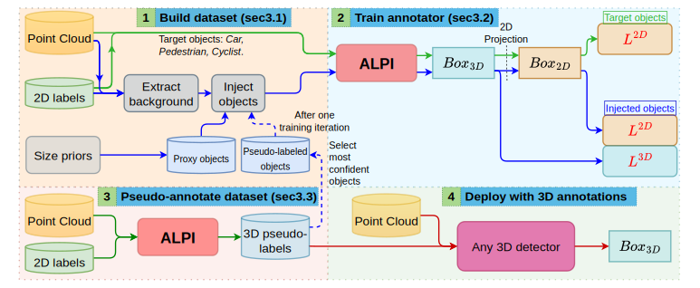

# ALPI: Auto-Labeller with Proxy Injection for 3D Object Detection using 2D Labels Only

This repository contains the official PyTorch implementation for the paper:

**ALPI: Auto-Labeller with Proxy Injection for 3D Object Detection using 2D Labels Only**
*Saad Lahlali, Nicolas Granger, Hervé Le Borgne, Quoc-Cuong Pham*
*Presented at IEEE/CVF Winter Conference on Applications of Computer Vision WACV 2025*
**[Paper](https://openaccess.thecvf.com/content/WACV2025/html/Lahlali_ALPI_Auto-Labeller_with_Proxy_Injection_for_3D_Object_Detection_using_WACV_2025_paper.html)**

-----

### **🖼️ Overview**



-----

## **📝 Abstract**

3D object detection plays a crucial role in various applications such as autonomous vehicles, robotics and augmented reality. However, training 3D detectors requires a costly precise annotation, which is a hindrance to scaling annotation to large datasets. To address this challenge, we propose a weakly supervised 3D annotator that relies solely on 2D bounding box annotations from images, along with size priors. One major problem is that supervising a 3D detection model using only 2D boxes is not reliable due to ambiguities between different 3D poses and their identical 2D projection. We introduce a simple yet effective and generic solution: we build 3D proxy objects with annotations by construction and add them to the training dataset. Our method requires only size priors to adapt to new classes. To better align 2D supervision with 3D detection, our method ensures depth invariance with a novel expression of the 2D losses. Finally, to detect more challenging instances, our annotator follows an offline pseudo-labelling scheme which gradually improves its 3D pseudo-labels. Extensive experiments on the KITTI dataset demonstrate that our method not only performs on-par or above previous works on the Car category, but also achieves performance close to fully supervised methods on more challenging classes. We further demonstrate the effectiveness and robustness of our method by being the first to experiment on the more challenging nuScenes dataset. We additionally propose a setting where weak labels are obtained from a 2D detector pre-trained on MS-COCO instead of human annotations.

-----

## **📄 Citation**

If you find our work useful in your research, please consider citing our paper:

```bibtex
@inproceedings{lahlali2025alpi,
  title={ALPI: Auto-Labeller with Proxy Injection for 3D Object Detection using 2D Labels Only},
  author={Lahlali, Saad and Granger, Nicolas and Le Borgne, Herv{\'e} and Pham, Quoc-Cuong},
  booktitle={2025 IEEE/CVF Winter Conference on Applications of Computer Vision (WACV)},
  pages={2185--2194},
  year={2025},
  organization={IEEE}
}
```

-----

## **✅ Release Checklist**

  - [x] Code for the **KITTI** dataset.
  - [ ] Code for the **nuScenes** dataset (coming soon).

-----

## **🛠️ Installation**

Our project is based on the same environment as Frustum ConvNet.

### **Requirements**

  * PyTorch 1.0+
  * Python 3.6+
  * CUDA 9.0+ 

### **Setup**

1.  **Clone the repository:**

    ```shell
    git clone https://github.com/CEA-LIST/ALPI.git
    cd ALPI
    ```

2.  **Install dependencies:**
    You may need to install additional packages.

    ```shell
    pip install numpy pybind11 opencv-python pyyaml tqdm
    ```

3.  **Compile custom extensions:**
    The project requires custom CUDA operators.

    ```shell
    cd ops
    bash make.sh
    ```

-----
Here are the rewritten instructions for your `readme.md` file to explain how to run the code, including details on the script arguments, running steps individually, and executing the entire process at once.

-----

## How to Run the Code

This section provides instructions for running the ALPI pipeline. You can either execute each stage of the process manually or use the provided shell script to run everything in a sequence.

### 1- Data Preparation 

First, download the official **KITTI 3D Object Detection Dataset** from their [website](http://www.cvlibs.net/datasets/kitti/eval_object.php?obj_benchmark=3d).

Organize the downloaded files into the following directory structure:

```text
data/kitti
├── testing
│   ├── calib
│   ├── image_2
│   └── velodyne
└── training
    ├── calib
    ├── image_2
    ├── label_2
    └── velodyne
```

###  2- ALPI Execution Pipeline 

This pipeline details the full process, from initial training with proxy objects to the final refinement step, using the pseudo-labels generated across stages. The `--ratio 30` flag will be used to control the proxy object injection rate.

#### **Available Scripts**

The execution is managed by three main scripts:

1.  `scripts/all_steps_script.sh`: The main script that runs the entire pipeline from start to finish. It calls the two scripts below in sequence.
2.  `scripts/step_script.sh`: Handles a single step of the iterative pseudo-labeling stage. It can be used for the initial data generation (step 0) and subsequent refinement steps (1, 2, ...).
3.  `scripts/refinement_script.sh`: Executes the final refinement stage, which uses the pseudo-labels generated from the iterative process to train a final, improved model.

#### **Running Everything at Once (Recommended)**

For convenience, you can use the `all_steps_script.sh` to run the entire pipeline, including all iterative steps and the final refinement.

#### **Arguments**

The script accepts the following optional arguments:

  * `--gpu GPU_TO_USE`: Specifies the GPU index to be used. Defaults to `0`.
  * `--ratio RATIO_FAKE_TO_REAL`: Sets the percentage of proxy ("Proxy") objects to be injected during the iterative pseudo-labeling steps. 

#### **Step 0: Initial Training with Proxy Injection**

This first step trains an initial model using the original dataset mixed with proxy objects. According to your specification, this step injects proxy objects at a 30% ratio relative to the real objects.

**Command:**

```shell
bash scripts/step_script.sh --gpu 0 --step 0 --ratio 30
```

**Behind the Command:**

  * **Setup:** The script first creates an output directory named `output/carpedcyc_step_00` and copies the model configuration file into it for reproducibility.
  * **Data Generation:** The script prepares the initial training data. In this custom run, this involves running `kitti/frustum_extractor.py` and then injecting proxy objects to achieve the 30% ratio, creating a mixed dataset for the first training round.
  * **Model Training:** The `train/train_net_det.py` script is executed to train the detector model on this initial data mix.
  * **Evaluation & Pseudo-Label Generation:** After training, two processes are launched:
    1.  `train/test_net_det.py` evaluates the model's performance on the validation set.
    2.  `train/gen_pseudo.py` uses the newly trained model to generate a set of pseudo-labels on the training set. These labels will serve as the foundation for the next step.
        The `wait` command ensures both tasks are finished before the script concludes.

-----

#### **Step 1: First Pseudo-Labelling Step**

This step uses the model from Step 0 to generate improved pseudo-labels and retrains on a new mix of data.

**Command:**

```shell
bash scripts/step_script.sh --gpu 0 --step 1 --ratio 30
```

**Behind the Command:**

  * **Setup:** A new directory, `output/carpedcyc_step_01_ratio_030`, is created to store the artifacts from this step.
  * **Data Generation:** This is a key step where the pseudo-labels generated in Step 0 are used.
    1.  `kitti/generate_instances_insert.py` is called to create new training instances with proxy objects injected at the specified 30% ratio.
    2.  `kitti/frustum_pseudolabeling.py` processes these instances to create the final training data file.
  * **Model Training:** The model is retrained from scratch using `train/train_net_det.py` on this newly generated and enriched dataset.
  * **Evaluation & Pseudo-Label Generation:** The cycle repeats. The retrained model is evaluated (`test_net_det.py`), and a new, more refined set of pseudo-labels is generated (`gen_pseudo.py`) for the next step.

-----

#### **Step 2: Second Pseudo-Labelling Step**

This step further refines the pseudo-labels by repeating the process from Step 1, now using the improved model as the teacher.

**Command:**

```shell
bash scripts/step_script.sh --gpu 0 --step 2 --ratio 30
```

**Behind the Command:**

  * **Setup:** A new directory, `output/carpedcyc_step_02_ratio_030`, is created.
  * **Data Generation:** The process is identical to Step 1, but it now uses the superior pseudo-labels generated at the end of Step 1 as its input, again with a 30% proxy injection ratio.
  * **Model Training:** The model is trained again on this even better dataset mix.
  * **Evaluation & Pseudo-Label Generation:** The model is evaluated, and a final, high-quality set of pseudo-labels is generated. These labels are the primary output of the entire pseudo-labelling stage and will be used for the final refinement.

-----

#### **Refinement Step**

This conclusive step takes the best pseudo-labels generated from Step 2 and trains a model on this high-confidence dataset. No proxy objects are used here.

**Command:**

```shell
bash scripts/refinement_script.sh --gpu 0 --ratio 30
```

**Behind the Command:**

  * **Pseudo-Label Preparation:** The script identifies the output directory from the previous step (`output/carpedcyc_step_02_ratio_030`). It then collects all the pseudo-labels from the training and validation runs and copies them into a unified directory: `data/kitti/training/label_2_pseudo`. This directory is cleaned beforehand to ensure no old labels remain.
  * **Setup:** A final output directory, `output/carpedcyc_train_refine`, is created for the refined model and its logs.
  * **Final Data Preparation:** The script `kitti/prepare_data_refine.py` is executed to prepare the training and validation sets using only the high-quality pseudo-labels collected in the previous step.
  * **Model Training (Refinement):** The final model is trained using `train/train_net_det.py` on this curated dataset.
  * **Final Evaluation & Generation:** The refined model is evaluated one last time with `test_net_det.py`, and a final set of pseudo-labels is generated using `gen_pseudo.py` to demonstrate the final model's capability.
-----


## **🙏 References and Acknowledgements**

This project builds upon the excellent work from the following repositories:

  * **Frustum ConvNet**: [Wang et al., IROS 2019](https://www.google.com/search?q=https://github.com/zhixinwang/frustum-convnet)
  * **F-PointNets**: [Qi et al., CVPR 2018](https://github.com/charlesq34/frustum-pointnets)

Our implementation is derived from their codebases, and we thank the authors for making their work publicly available.

-----

## **📜 License**


[CeCILL](http://www.cecill.info/licences.fr.html) licence version 2.1.

See LICENSE for details.